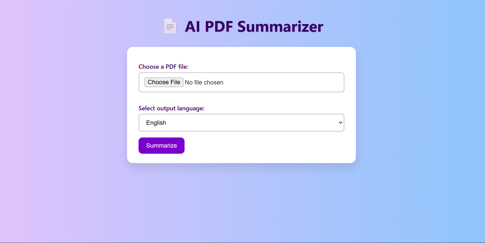
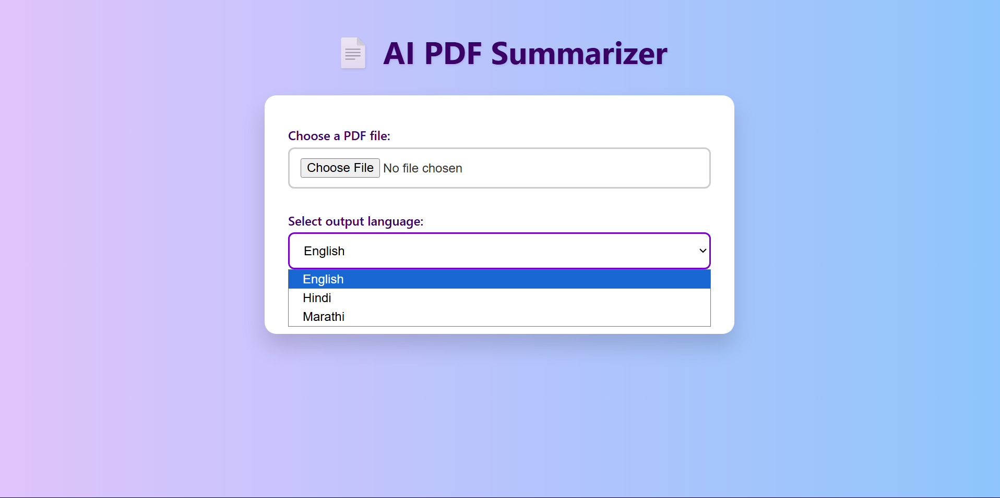
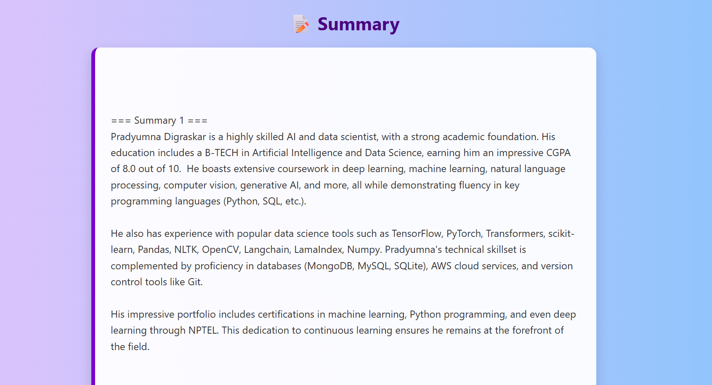
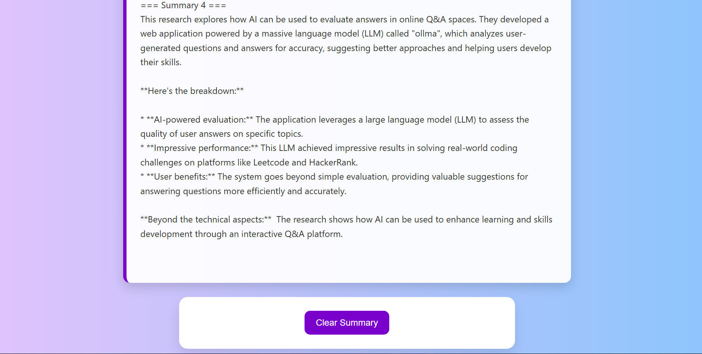

<p align="center">
  
</p>

<h1 align="center">📚 AI PDF Summarizer</h1>

<p align="center">
  <b>Summarize your PDFs in seconds using AI!</b><br/>
  <i>Upload a PDF, pick your language, and get a concise summary instantly.</i>
</p>

<p align="center">
  
  
  
</p>

---

## 🚀 Quick Start

1. **Install dependencies:**
   ```bash
   pip install -r requirements.txt
   ```
2. **Run the app:**
   ```bash
   python app.py
   ```
3. **Open in browser:** [http://127.0.0.1:5000/](http://127.0.0.1:5000/)

---

## ✨ Features
- 📄 Upload PDF files for instant AI-powered summaries
- 🌐 Multilingual: English, Hindi, Marathi
- 🧩 Handles large documents by smart chunking
- 🖥️ Clean, modern web interface
- 🧠 Powered by Ollama & Langchain
- 🔄 One-click clear summary

---

## 🖼️ Visual Workflow

> **Add your screenshots in the `static/` folder and update the image links below!**

| Main Page | Language Selection | Summarized Text | Clear Summary |
|-----------|-------------------|-----------------|--------------|
|  |  |  |  |

---

## 🛠️ Tech Stack
- **Python 3.x**
- **Flask** (web framework)
- **PyMuPDF** (PDF parsing)
- **Langchain** (text splitting)
- **Ollama** (AI summarization)

---

## 📁 Project Structure
```
app.py           # Main app
summarizer.py    # AI logic
static/          # Styles, images, and screenshots
templates/       # HTML
uploads/         # Your PDFs
```

---

## 🤔 How It Works
1. **Upload** a PDF file from your device.
2. **Select** your preferred output language.
3. **Click Summarize** to generate a concise summary using AI.
4. **View** the summary instantly on the page.
5. **Clear** the summary with one click to start over.

---

## 📦 Requirements
All dependencies are listed in `requirements.txt`.

---

## 📜 License
*For demo/educational use only. Check dependencies for their respective licenses.* 